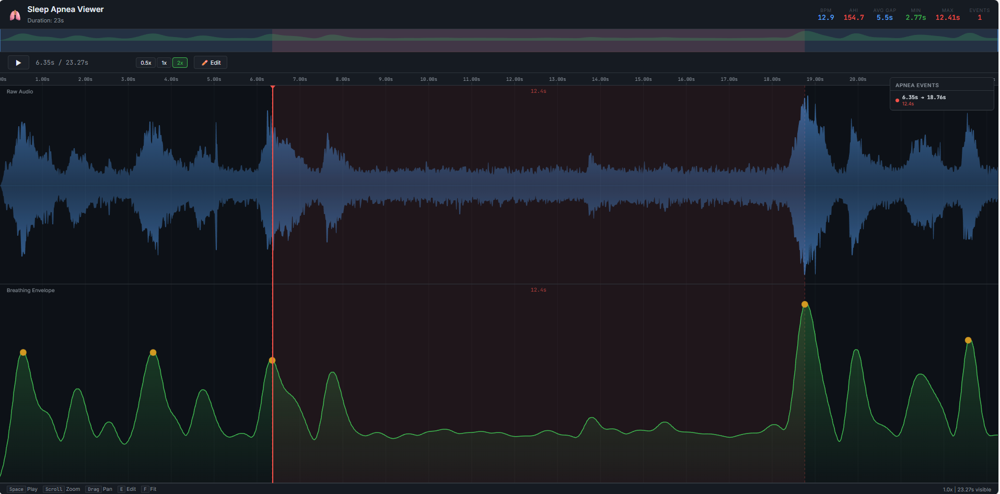

# Sleep Apnea Detector & Visualizer 🫁

A robust Python-based tool for analyzing sleep audio recordings to detect sleep apnea events (pauses in breathing). It generates a comprehensive report and includes a **high-performance, interactive HTML viewer** (Perfetto-style) for detailed analysis.

## Features ✨

### 🔍 **Advanced Detection Algorithm**
- **Dual-Method Detection**: Combines **Rolling-Max Activity Analysis** (primary) with **Inter-Peak Gap Detection** (secondary) for maximum accuracy.
- **Noise-Resilient**: Automatically estimates and subtracts background noise floor to detect breathing even in noisy recordings.
- **Hypopnea Detection**: Detects significant drops in breathing amplitude (hypopnea), not just complete silence.

### 📊 **Interactive HTML Viewer**
A generated `sleep_report.html` file provides a fully interactive visualization:
- **Zoomable Timeline**: Smoothly zoom from hours down to milliseconds (Scroll wheel / `+` `-`).
- **Audio Playback**: Listen to specific events directly in the browser with speed controls (0.5x, 1x, 2x).
- **Dynamic Waveform**: Audio graph auto-scales to fill the view, making quiet breathing visible.
- **Live Recomputation**: Edit detection results in real-time!
    - **Add Breaths**: Click on the envelope to manually mark a missed breath.
    - **Remove Breaths**: Click on a false detection to remove it.
    - **Instant Updates**: AHI, BPM, and Apnea Events recalculate instantly upon editing.

## Installation 📦

Ensure you have Python 3.8+ installed.

1.  **Clone the repository**:
    ```bash
    git clone https://github.com/yourusername/sleep-apnea-detector.git
    cd sleep-apnea-detector
    ```

2.  **Install dependencies**:
    ```bash
    pip install numpy scipy librosa moviepy
    ```
    *(Note: `moviepy` requires FFMPEG installed on your system)*

## Usage 🚀

1.  **Prepare your audio file**:
    Place your recording (e.g., `sleep_recording.mp4`, `.wav`, `.mp3`) in the project folder.

2.  **Edit the input file path**:
    Open `sleep.py` and modify the `INPUT_FILE` variable at the bottom:
    ```python
    if __name__ == "__main__":
        INPUT_FILE = "my_sleep_recording.mp4" 
    ```

3.  **Run the analysis**:
    ```bash
    python sleep.py
    ```

4.  **View Results**:
    - The script will print a summary report to the console.
    - It will automatically open `sleep_report.html` in your default web browser.

## Configuration ⚙️

You can tune the detection sensitivity in `sleep.py`:

| Parameter | Default | Description |
| :--- | :--- | :--- |
| `MIN_APNEA_DURATION` | `10.0` | Minimum silence duration (seconds) to count as an apnea event. |
| `apnea_activity_ratio` | `0.5` | Threshold for "breathing activity" relative to normal. Lower = less sensitive. |
| `breath_sensitivity` | `0.45` | Minimum peak height (above noise) to count as a breath. Higher = fewer false positives. |
| `activity_window` | `5.0` | Window size (seconds) for analyzing breathing activity levels. |

## Interactive Viewer Guide 🖥️

### Navigation
- **Zoom**: Scroll wheel (Mouse) or `+` / `-` keys.
- **Pan**: Click & Drag or `←` / `→` keys.
- **Fit View**: Press `F` to reset zoom to the full duration.
- **Jump to Event**: Click an event in the sidebar list to zoom directly to it.

### Playback
- **Play/Pause**: Press `Space` or click the play button.
- **Seek**: Click anywhere on the timeline/track area.
- **Speed**: Use the `0.5x`, `1x`, `2x` buttons to review quickly.

### Editing Findings ✏️
1.  Click the **Edit** button (or press `E`) to toggle Edit Mode.
2.  **Add a Breath**: Click usually on the **Green Envelope** line where a breath occurred but was missed.
3.  **Remove a Breath**: Hover over a yellow dot (detected peak) until it turns red, then click to delete.
4.  Observe the Stats box update instantly!

## Screenshots 📸



*The interactive viewer showing detected peaks, apnea events, and the dynamic audio waveform.*

## License 📄

MIT License - feel free to use and modify!
